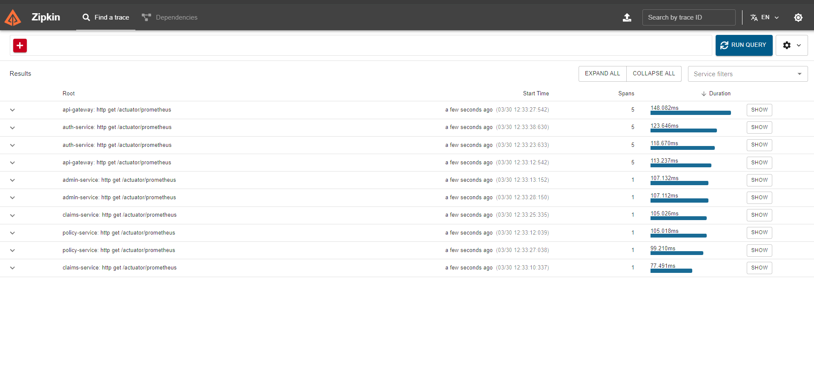
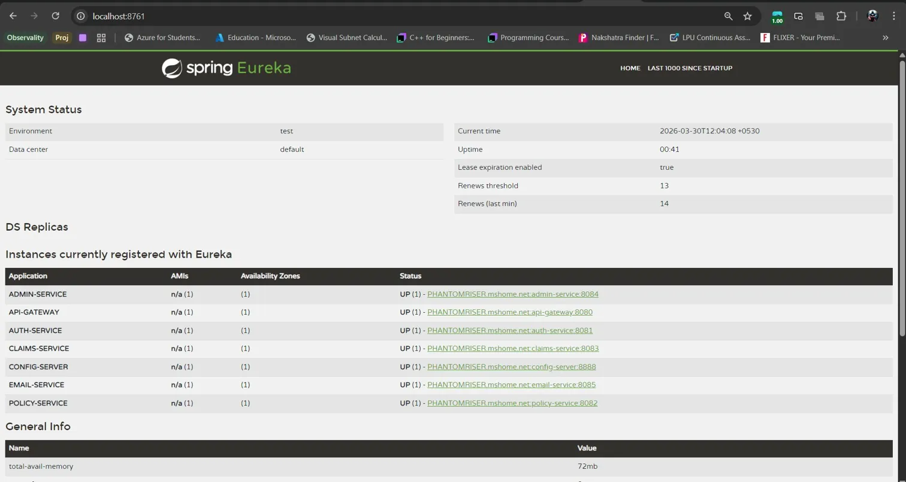
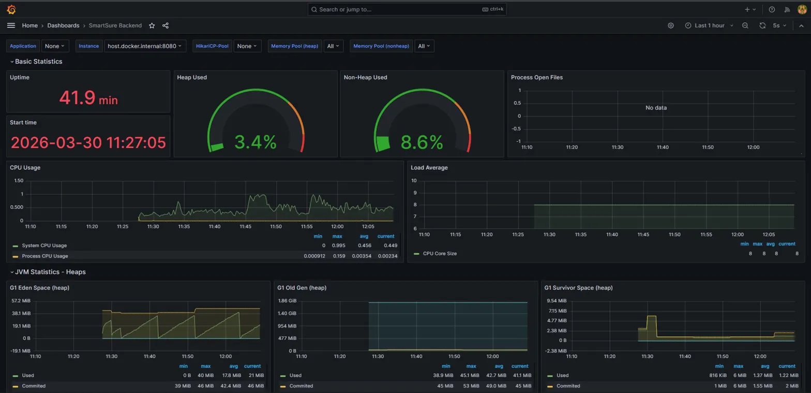
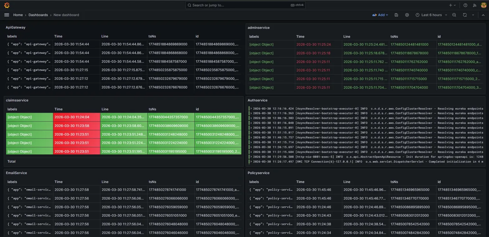
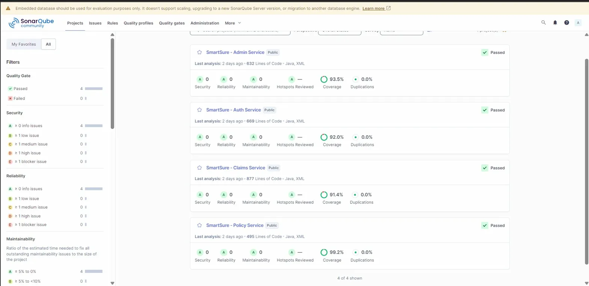

# SmartSure Insurance Platform — Backend Architecture


---

## Overview

SmartSure is a scalable, event-driven microservices backend platform designed for the modern insurance industry. It provides a complete end-to-end ecosystem for authentication, policy management, claims processing, administrative control, and real-time observability — built to production standards.

---

## Key Features

### Authentication and Security

- JWT-based stateless authentication with refresh token mechanism
- Dual login system: standard login and opt-in Multi-Factor Authentication (MFA) via email OTP
- Secure forgot/reset password flow using email verification
- Role-Based Access Control (RBAC) enforced at the API Gateway level

### Event-Driven Architecture

- Asynchronous service communication via RabbitMQ (SAGA choreography pattern)
- Services publish events on state changes; Email Service consumes and sends notifications
- Core flows remain fast and non-blocking — emails delivered in the background

### API Standardization

- 100% of endpoints documented using Swagger (OpenAPI 3)
- Professional security tagging: `🔒 [ADMIN]`, `👤 [OWNER]`, `🌐 [PUBLIC]`
- Centralized `ApiResponse` wrapper across all services

### Data Integrity

- Mandatory evidence upload validation before claim submission
- Duplicate file detection to prevent redundant document uploads
- Centralized exception handling with structured error responses

### Resilience and Gateway

- API Gateway as the single entry point with JWT validation, rate limiting, global logging, and CORS
- Circuit breakers via Resilience4j to prevent cascading failures
- Health checks and intelligent container startup ordering in Docker Compose

---

## Technology Stack

| Category      | Technologies                                       |
|---------------|----------------------------------------------------|
| Backend       | Java 17, Spring Boot 3.x                           |
| Microservices | Spring Cloud, Netflix Eureka, Gateway, OpenFeign   |
| Database      | MySQL (Database-per-Service pattern)               |
| Messaging     | RabbitMQ                                           |
| Security      | Spring Security, JWT, BCrypt                       |
| Mapping       | MapStruct, Lombok                                  |
| Documentation | SpringDoc OpenAPI (Swagger 3)                      |
| Resilience    | Resilience4j (Circuit Breaker, Retry)              |
| Observability | Zipkin, Prometheus, Grafana, Loki                  |
| Quality       | SonarQube, JUnit 5, Mockito, JaCoCo                |
| Deployment    | Docker, Docker Compose                             |

---

## Project Structure

```text
smartsure-backend/
├── api-gateway/          # Central entry point, JWT validation, rate limiting
├── eureka-server/        # Service discovery and registry
├── config-server/        # Centralized configuration (backed by Git repo)
├── auth-service/         # User identity, JWT generation, MFA, refresh tokens
├── policy-service/       # Policy purchase, premium calculation, lifecycle
├── claims-service/       # Claim submission, evidence uploads, state tracking
├── admin-service/        # Reports, audit trail, claim approvals, caching
└── email-service/        # Async email notifications via RabbitMQ + Gmail SMTP
```

Each microservice follows a strict Domain-Driven Design (DDD) layout:

```text
src/main/java/com/smartsure/{service}/
├── config/         # Security, Swagger, RabbitMQ configurations
├── controller/     # REST endpoints
├── dto/            # Request and Response DTOs
├── entity/         # JPA database entities
├── exception/      # Global exception handlers
├── mapper/         # MapStruct interfaces
├── repository/     # Spring Data JPA repositories
├── security/       # JWT and role extraction logic
└── service/        # Core business logic
```

---

## API Documentation

Once services are running, interactive Swagger docs are available at:

| Service        | URL                                    |
|----------------|----------------------------------------|
| Auth Service   | http://localhost:8081/swagger-ui.html  |
| Policy Service | http://localhost:8082/swagger-ui.html  |
| Claims Service | http://localhost:8083/swagger-ui.html  |
| Admin Service  | http://localhost:8084/swagger-ui.html  |

> In a fully deployed environment, all endpoints are routed through the API Gateway at port `8080`.

---

## Running the Application

### Prerequisites

- Java 17 or higher
- Maven 3.8 or higher
- MySQL (running locally or via Docker)
- RabbitMQ (running locally or via Docker)

### Startup Order

Because of service dependencies, boot in this order:

1. Eureka Server (service registry must be up first)
2. Config Server
3. API Gateway
4. Auth, Policy, Claims, Admin, Email services (any order)

### Using Docker Compose

```bash
docker-compose up --build
```

Docker Compose handles startup ordering automatically via health checks. All services run on a private `smartsure-network` bridge and reference each other by service name.

---

## Code Quality and Observability

SmartSure is built to production standards — every service is monitored, analyzed, and traced in real-time.

---

### Distributed Tracing — Zipkin

Every request is assigned a unique Trace ID at the API Gateway. As it hops across services, that ID travels with it. Zipkin visualizes the full journey with per-hop latency — making bottlenecks immediately visible.

> All 6 microservices actively reporting spans: auth, email, api-gateway, admin, policy, claims.



---

### Service Discovery — Spring Eureka

All 7 services self-register with Eureka on startup. The API Gateway resolves service locations dynamically — no hardcoded IPs or ports.

> Status: **7/7 services UP** — Admin, API Gateway, Auth, Claims, Config Server, Email, Policy.



---

### Real-Time Metrics — Grafana + Prometheus

Every service exposes `/actuator/prometheus`. Grafana scrapes these endpoints and visualizes JVM heap usage, CPU load, thread counts, GC activity, and request rates in real-time.

> Dashboard: SmartSure Backend — live JVM heap at 3.4%, CPU stable, G1 GC healthy across 41+ minutes of uptime.



---

### Centralized Log Aggregation — Loki

All container logs from every microservice are aggregated into Loki and displayed through Grafana. Each service panel shows timestamped log streams — with errors highlighted — all visible from a single screen.

> Live logs for: ApiGateway, ClaimsService, EmailService, AdminService, AuthService, PolicyService.



---

### Static Code Analysis — SonarQube

All core business services were analyzed through SonarQube. Every service passed the Quality Gate with zero security, reliability, and maintainability issues.

| Service         | Lines of Code | Coverage | Quality Gate |
|-----------------|---------------|----------|--------------|
| Admin Service   | 632           | 93.5%    | ✅ Passed    |
| Auth Service    | 669           | 92.0%    | ✅ Passed    |
| Claims Service  | 877           | 91.4%    | ✅ Passed    |
| Policy Service  | 495           | 99.2%    | ✅ Passed    |



---

## Security Model

- Zero-trust API Gateway: no request reaches a service without a valid signed JWT
- Gateway extracts identity from JWT and injects `X-UserId` and `X-User-Roles` headers
- Downstream services trust these headers — no session state maintained anywhere
- Ownership guards on Claims endpoints: users can only access their own data
- File uploads sanitized with UUID prefixes to prevent path traversal attacks

---

## Testing

```bash
mvn clean test
```

- Unit tests written with JUnit 5 and Mockito
- All 37 unit tests passing across services
- JaCoCo configured for coverage reporting

---

## Database Architecture

Following the **Database-per-Service** pattern:

| Database    | Owned By        |
|-------------|-----------------|
| `auth_db`   | Auth Service    |
| `policy_db` | Policy Service  |
| `claims_db` | Claims Service  |
| `admin_db`  | Admin Service   |

Services never query each other's databases directly. Cross-service data access happens only through Feign HTTP calls or RabbitMQ events.

---

## Future Enhancements

- CI/CD pipeline integration (GitHub Actions)
- Cloud deployment on AWS or Azure
- Kubernetes orchestration
- Advanced rate limiting with Redis

---

## Author

**Hanumanthu Nani**  
Software Engineer  
Lovely Professional University

---

## License

This project is intended for educational and demonstration purposes.
